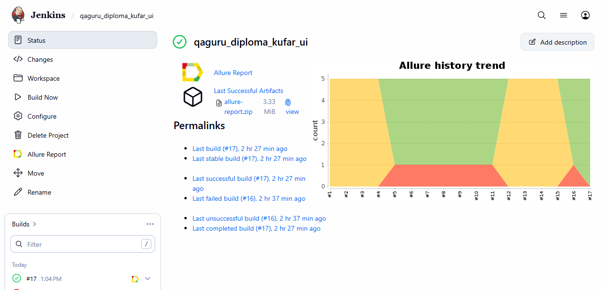
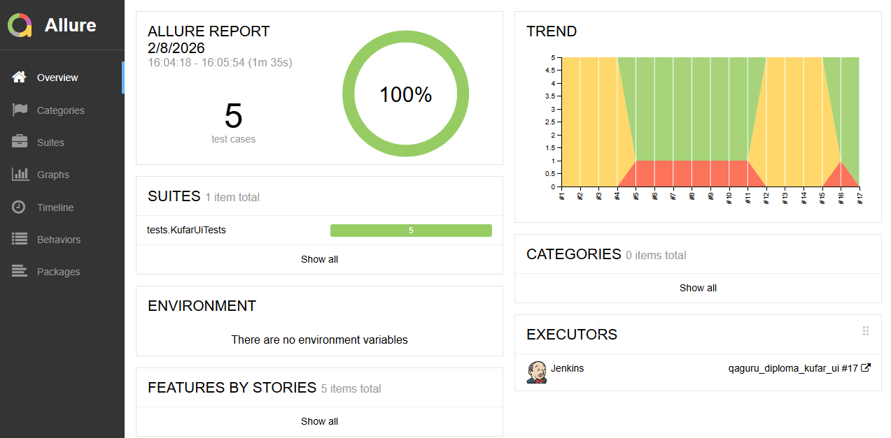
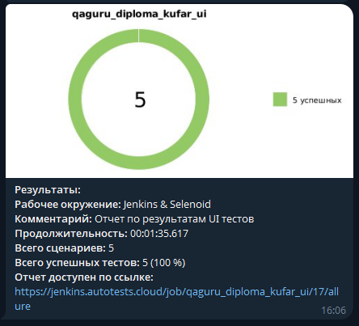

# Проект по автоматизации тестирования для онлайн-площадки объявлений [Kufar](https://www.kufar.by/l) 

>Куфар (Kufar) — это крупнейшая в Беларуси онлайн-площадка объявлений, где пользователи покупают и продают новые и б/у товары, недвижимость, автомобили, а также предлагают услуги. Ежемесячно сайт посещают более 5 миллионов пользователей.

## 🧾 Содержание

- [Описание проекта](#-описание-проекта)
- [Стек технологий](#-стек-технологий)
- [Реализованные проверки](#-реализованные-проверки)
- [Инфраструктура](#-инфраструктура)
- [Результаты визуализации](#-результаты-визуализации-примеры)

## 📌 Описание проекта

Данный проект представляет собой дипломную работу по автоматизации тестирования пользовательского интерфейса (UI) популярного маркетплейса Беларуси — Kufar.  
**Цель проекта:** реализовать автотесты на критически важный функционал сайта, обеспечить их стабильный запуск в CI/CD и настроить наглядную отчетность.

## 🛠 Стек технологий

   
   
   
   
   
    
    
   
   
   

- Язык программирования: Java  
- Фреймворк для UI-тестов: Selenide  
- Тестовый фреймворк: JUnit 5  
- Сборщик проекта: Gradle  
- CI/CD: Jenkins  
- Отчетность: Allure Report  
- Уведомления: Telegram Bot
- Удаленный запуск браузеров: Selenoid  

## ✅ Реализованные проверки
В проекте автоматизированы следующие сценарии (UI):

- Поиск товара и проверка текста
- Переход по вкладке Авто и проверка URL
- Поиск некорректных данных
- Переключение языка на белорусский в футере
- Выбор региона

## 🏗 Инфраструктура

### 1. Запуск тестов
   
Тесты запускаются с помощью Gradle. Для локального запуска:  

   `clean test`

### 2. Удаленный запуск в [Jenkins](https://jenkins.autotests.cloud/job/qaguru_diploma_kufar_ui/)
Сборка настроена в **Jenkins**.
-  Тесты выполняются удаленно в контейнерах **Selenoid**.

### 3. [Allure Report](https://jenkins.autotests.cloud/job/qaguru_diploma_kufar_ui/17/allure/)
После завершения тестов генерируется подробный отчет, который включает:
-  Шаги выполнения каждого теста (@Step).
-  Скриншот страницы на момент падения (или успеха).
-  Логи консоли браузера.
-  Видеозапись прохождения теста.
### 4. Уведомления в Telegram
Интегрирован бот, который отправляет краткий отчет о результатах сборки в Telegram-чат. В сообщении содержится информация о количестве упавших/пройденных тестов и ссылка на полный Allure-отчет.

## 📊 Результаты визуализации (Примеры)

### Главная страница [Allure](https://jenkins.autotests.cloud/job/qaguru_diploma_kufar_ui/17/allure/)

### Уведомление в Telegram

### Пример видео из Selenoid

